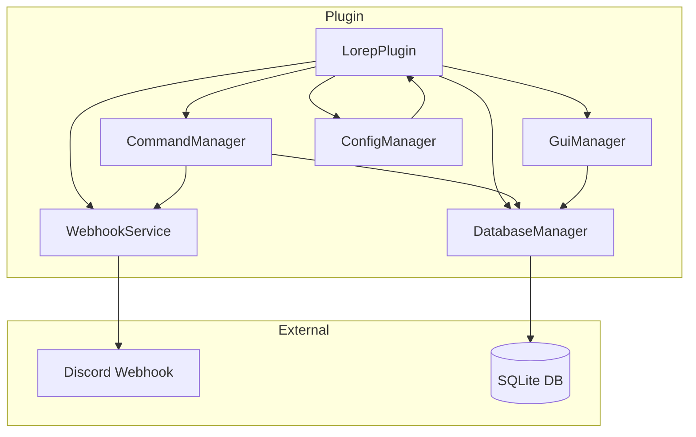

# Design Document: lorep Report Plugin

## Overview

Плагин lorep — система репортов для Paper 1.21, написанная на Java 21. Использует Gradle для сборки, SQLite для хранения данных и интегрируется с Discord через webhooks.

**Технологический стек:**
- Java 21
- Paper API 1.21
- Gradle (Kotlin DSL)
- SQLite (встроенная БД) или PostgreSQL (внешняя БД)
- HikariCP (connection pool для PostgreSQL)
- OkHttp (HTTP клиент для webhooks)

**Git репозиторий:** https://git.lokili.xyz/loki/lorep.git

## Architecture



### Структура проекта

```
lorep/
├── .gitignore
├── build.gradle.kts
├── settings.gradle.kts
├── src/
│   └── main/
│       ├── java/
│       │   └── dev/
│       │       └── loki/
│       │           └── lorep/
│       │               ├── LorepPlugin.java
│       │               ├── command/
│       │               │   ├── ReportCommand.java
│       │               │   ├── ReportGuiCommand.java
│       │               │   └── ReportStatsCommand.java
│       │               ├── database/
│       │               │   ├── DatabaseManager.java
│       │               │   ├── SQLiteDatabaseManager.java
│       │               │   ├── PostgreSQLDatabaseManager.java
│       │               │   └── Report.java
│       │               ├── gui/
│       │               │   ├── ReportGui.java
│       │               │   └── GuiClickListener.java
│       │               ├── webhook/
│       │               │   └── DiscordWebhook.java
│       │               ├── config/
│       │               │   └── ConfigManager.java
│       │               └── util/
│       │                   ├── TimeUtil.java
│       │                   └── MessageUtil.java
│       └── resources/
│           ├── plugin.yml
│           └── config.yml
└── src/
    └── test/
        └── java/
            └── dev/
                └── loki/
                    └── lorep/
                        ├── database/
                        │   └── DatabaseManagerTest.java
                        └── util/
                            └── TimeUtilTest.java
```

## Components and Interfaces

### 1. LorepPlugin (Main Class)

```java
public final class LorepPlugin extends JavaPlugin {
    private DatabaseManager databaseManager;
    private ConfigManager configManager;
    private DiscordWebhook discordWebhook;
    
    @Override
    public void onEnable();
    
    @Override
    public void onDisable();
    
    // Getters for managers
}
```

### 2. Report (Data Model)

```java
public record Report(
    int id,
    UUID reporterUuid,
    String reporterName,
    UUID targetUuid,
    String targetName,
    String reason,
    Instant createdAt
) {}
```

### 3. DatabaseManager

```java
public interface DatabaseManager {
    void initialize();
    void close();
    
    void saveReport(Report report);
    List<Report> getReportsForTarget(UUID targetUuid);
    List<Report> getAllReports();
    int getReportCount(UUID targetUuid);
    boolean hasReported(UUID reporterUuid, UUID targetUuid);
    List<Report> getReportsPaginated(int page, int pageSize);
}

// Реализации:
public class SQLiteDatabaseManager implements DatabaseManager { }
public class PostgreSQLDatabaseManager implements DatabaseManager { }
```

### 4. DiscordWebhook

```java
public class DiscordWebhook {
    public DiscordWebhook(String webhookUrl);
    
    public void sendReport(Report report);
}
```

### 5. ConfigManager

```java
public class ConfigManager {
    public String getWebhookUrl();
    public String getDatabasePath();
    public String getMessage(String key);
}
```

### 6. ReportGui

```java
public class ReportGui {
    public void open(Player player, int page);
    public ItemStack createReportItem(Report report, int totalReports);
}
```

## Data Models

### Report Entity

| Field | Type | Description |
|-------|------|-------------|
| id | INTEGER | Primary key, auto-increment |
| reporter_uuid | TEXT | UUID репортера |
| reporter_name | TEXT | Имя репортера |
| target_uuid | TEXT | UUID цели |
| target_name | TEXT | Имя цели |
| reason | TEXT | Причина репорта |
| created_at | INTEGER | Unix timestamp создания |

### SQL Schema

```sql
CREATE TABLE IF NOT EXISTS reports (
    id INTEGER PRIMARY KEY AUTOINCREMENT,
    reporter_uuid TEXT NOT NULL,
    reporter_name TEXT NOT NULL,
    target_uuid TEXT NOT NULL,
    target_name TEXT NOT NULL,
    reason TEXT NOT NULL,
    created_at INTEGER NOT NULL
);

CREATE INDEX idx_target_uuid ON reports(target_uuid);
CREATE INDEX idx_reporter_target ON reports(reporter_uuid, target_uuid);
```

### Configuration (config.yml)

```yaml
# Discord Webhook URL
webhook-url: ""

# Database settings
database:
  # Type: sqlite or postgresql
  type: "sqlite"
  
  # SQLite settings
  sqlite:
    file: "reports.db"
  
  # PostgreSQL settings
  postgresql:
    host: "localhost"
    port: 5432
    database: "lorep"
    username: "lorep"
    password: "password"
    pool-size: 10

# Messages
messages:
  report-sent: "&aРепорт успешно отправлен!"
  already-reported: "&cВы уже отправляли репорт на этого игрока!"
  self-report: "&cВы не можете отправить репорт на себя!"
  player-not-found: "&cИгрок не найден!"
  no-permission: "&cУ вас нет прав на эту команду!"
  usage: "&eИспользование: /report <ник> <причина>"
```

## Correctness Properties

*A property is a characteristic or behavior that should hold true across all valid executions of a system-essentially, a formal statement about what the system should do. Properties serve as the bridge between human-readable specifications and machine-verifiable correctness guarantees.*

### Property 1: Report Creation Integrity
*For any* valid reporter UUID, target UUID, and reason string, creating a report and then querying reports for that target SHALL return a list containing the created report with matching fields.
**Validates: Requirements 1.1, 2.1**

### Property 2: Duplicate Report Prevention
*For any* reporter-target pair, if a report already exists from that reporter to that target, attempting to create another report SHALL be rejected.
**Validates: Requirements 1.2**

### Property 3: Report Persistence Round-Trip
*For any* set of reports saved to the database, reloading the database SHALL return the same reports with identical data.
**Validates: Requirements 2.2**

### Property 4: Report Ordering
*For any* collection of reports with different timestamps, querying all reports SHALL return them sorted by creation timestamp in descending order (newest first).
**Validates: Requirements 2.3**

### Property 5: Webhook Payload Completeness
*For any* report sent to the webhook, the payload SHALL contain reporter name, target name, reason, and formatted timestamp.
**Validates: Requirements 3.1**

### Property 6: Pagination Correctness
*For any* list of N reports and page size P, requesting page K SHALL return at most P reports starting from index K*P, and the total page count SHALL equal ceil(N/P).
**Validates: Requirements 4.4**

### Property 7: Report Count Accuracy
*For any* target UUID, the report count returned by getReportCount SHALL equal the actual number of reports in the database for that target.
**Validates: Requirements 5.1**

### Property 8: Permission Enforcement
*For any* command execution, if the player lacks the required permission, the command SHALL be denied and return false.
**Validates: Requirements 6.1, 6.2, 6.3**

### Property 9: Configuration Parsing
*For any* valid config.yml file, parsing SHALL correctly extract webhook URL and database path values.
**Validates: Requirements 7.1, 7.3, 7.4**

## Error Handling

| Scenario | Handling |
|----------|----------|
| Database connection failure | Log error, disable plugin gracefully |
| Webhook request failure | Log warning, continue operation |
| Invalid player name | Return error message to player |
| Missing config values | Use default values |
| SQL exceptions | Log error, return empty result |

## Testing Strategy

### Property-Based Testing Library
- **JQwik** — библиотека для property-based тестирования в Java
- Минимум 100 итераций на каждый property test

### Unit Tests
- DatabaseManager: CRUD операции, pagination
- TimeUtil: форматирование времени
- ConfigManager: парсинг конфигурации

### Property-Based Tests
Каждый property test должен быть аннотирован:
```java
// **Feature: lorep-report-plugin, Property 1: Report Creation Integrity**
@Property(tries = 100)
void reportCreationIntegrity(@ForAll UUID reporter, @ForAll UUID target, @ForAll String reason) {
    // test implementation
}
```

### Integration Tests
- Полный цикл создания репорта
- GUI открытие и навигация
- Webhook отправка (с mock сервером)
